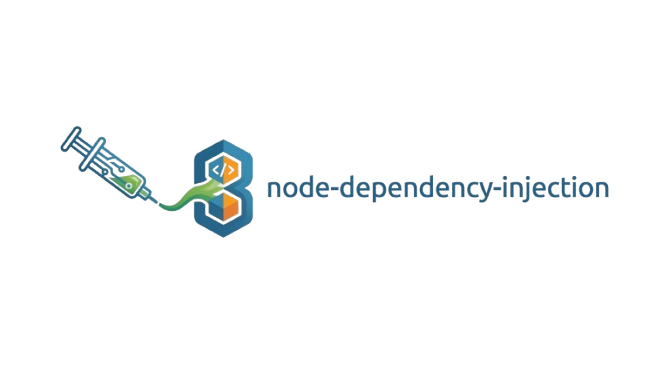

<p align="center">
  
</p>

<h1 align="center">Node Dependency Injection</h1>

<p align="center">
  <strong>Modern TypeScript DI without decorators and without reflect-metadata.</strong><br/>
  Autowiring, validation, and container compilation for maintainable Node.js services.<br/>
  Inspired by the battle-tested <a href="http://symfony.com">Symfony</a> DI container.<br/>
  <a href="https://node-di.dev/">node-di.dev</a>
</p>

<p align="center">
  <a href="https://badge.fury.io/js/node-dependency-injection"></a>
  
  <a href="https://codecov.io/gh/zazoomauro/node-dependency-injection"></a>
  <a href="https://www.npmjs.com/package/node-dependency-injection"></a>
  <a href="https://snyk.io/test/github/zazoomauro/node-dependency-injection"></a>
  <a href="https://github.com/zazoomauro/node-dependency-injection/blob/master/LICENCE"></a>
</p>

---

## Why Node Dependency Injection?

Managing dependencies manually leads to tightly coupled, hard-to-test code. **Node Dependency Injection** gives you a powerful, flexible IoC container that wires your application together — keeping your classes clean, your tests simple, and your architecture solid.

If you are comparing options in 2026, the core value is simple: **TypeScript autowiring by class, without decorators, without runtime metadata hacks, with compile-time style validation workflows.**

---

## ✨ Features

| | |
|---|---|
| 🔄 **Autowire** — zero-config DI for TypeScript | 📁 **Config files** — YAML, JSON or JS |
| 🏭 **Factory pattern** — flexible service creation | 🏷️ **Service tagging** — group & inject by tag |
| 💤 **Lazy services** — instantiate only when needed | 🎨 **Decorators** — wrap services transparently |
| ⚡ **Compiler passes** — transform the container at build time | 🔒 **Private services** — encapsulate internals |
| 🌳 **Parent / Abstract services** — share config via inheritance | 🧩 **Non-shared services** — new instance per call |
| 🌿 **Environment parameters** — `%env(VAR)%` support | 🗑️ **Deprecation warnings** — mark services as deprecated |
| 📦 **Express middleware** — first-class web framework support | 🖥️ **CLI** — inspect &amp; validate your container |
| 🔀 **Conditional services** — register services based on env or other services | 🗝️ **Keyed services** — named strategy pattern with `registerKeyed` |
| 🔗 **Autowire + Keyed** — inject keyed services via parameter binds | |

---

## 📊 Why choose NDI over Awilix, InversifyJS or tsyringe?

The goal is not to attack alternatives. This table explains the concrete trade-offs and where NDI is opinionated.

| Feature | node-dependency-injection | InversifyJS | tsyringe | Awilix |
|---|---|---|---|---|
| Config files (YAML / JSON / JS) | ✅ Native | ⚠️ Programmatic-first | ⚠️ Programmatic-first | ⚠️ Programmatic-first |
| TypeScript autowire without decorators | ✅ Native | ❌ | ❌ | ❌ |
| Keyed services (named strategy groups) | ✅ Native | ⚠️ Via custom patterns | ⚠️ Via tokens/patterns | ⚠️ Via aliases/patterns |
| Conditional service registration | ✅ Native | ⚠️ Manual logic | ⚠️ Manual logic | ⚠️ Manual logic |
| Compiler passes / compile-time transforms | ✅ Native | ❌ | ❌ | ❌ |
| Service tags and tagged lookup | ✅ Native | ⚠️ Manual metadata patterns | ⚠️ Manual token patterns | ⚠️ Naming/registration patterns |
| Private services | ✅ Native | ⚠️ Container conventions | ⚠️ Container conventions | ⚠️ Container conventions |
| CLI container inspection / validation | ✅ Native (`ndi`) | ❌ | ❌ | ❌ |
| Parent / abstract definitions | ✅ Native | ⚠️ Composition-based | ⚠️ Composition-based | ⚠️ Composition-based |
| Lazy services | ✅ Native | ✅ | ⚠️ Partial patterns | ⚠️ Partial patterns |

> Legend: ✅ built-in, ⚠️ possible with custom conventions or extra setup, ❌ not available as a first-class feature.

---

## 🚀 Installation

Website: [node-di.dev](https://node-di.dev/)

```sh
npm install --save node-dependency-injection
```

---

## 🏁 Quick Start

Start with class-based autowiring (the default recommendation):

```ts
import { Autowire, ContainerBuilder } from 'node-dependency-injection'
import UserService from '@src/service/UserService'

const container = new ContainerBuilder(false, '/path/to/src')
const autowire = new Autowire(container)

await autowire.process()
await container.compile()

const userService = container.get(UserService)
```

No decorators. No tokens. No `reflect-metadata`.

Prefer explicit IDs and programmatic registration? You can still do that:

```js
import { ContainerBuilder } from 'node-dependency-injection'
import Mailer from './services/Mailer'
import ExampleService from './services/ExampleService'

const container = new ContainerBuilder()

container.register('service.example', ExampleService)
container.register('service.mailer', Mailer).addArgument('service.example')

await container.compile()

const mailer = container.get('service.mailer')
```

---

## 🔄 Autowire (TypeScript)

Zero-configuration dependency injection — NDI reads your TypeScript type annotations and wires everything automatically:

```ts
import { ContainerBuilder, Autowire } from 'node-dependency-injection'

const container = new ContainerBuilder(false, '/path/to/src')
const autowire = new Autowire(container)
await autowire.process()
await container.compile()

// Retrieve by class — no string IDs needed
import SomeService from '@src/service/SomeService'
const service = container.get(SomeService)

// Or retrieve by ID with an explicit type
const typedService = container.get<SomeService>('service.some')
```

> **Production tip:** dump the autowired config to a YAML file and load it directly in prod — no TypeScript scanning overhead.

```ts
if (process.env.NODE_ENV === 'development') {
  const autowire = new Autowire(container)
  autowire.serviceFile = new ServiceFile('/dist/services.yaml')
  await autowire.process()
} else {
  const loader = new YamlFileLoader(container)
  await loader.load('/dist/services.yaml')
}
await container.compile()
```

The generated `services.yaml` uses **human-readable service IDs** derived from the file path relative to your source root (e.g. `Service/Mailer`), making it easy to review, audit, and debug your application's service graph:

```yaml
# services.yaml (human-readable — default since v4.0)
services:
  Service/Mailer:
    class: /Service/Mailer
    arguments:
      - '@Service/Transport'
  Service/Transport:
    class: /Service/Transport
    arguments: []
```

### Service ID strategy

| Strategy | Default | Service ID example | Description |
|---|---|---|---|
| `readable` | ✅ v4.0+ | `Service/Mailer` | Path relative to `defaultDir`, extension stripped |
| `legacy` | v3.x | `U2VydmljZS9NYWlsZXI=` | Base64-encoded absolute path |

To opt back in to the legacy strategy (e.g. for gradual migration):

```ts
const autowire = new Autowire(container)
autowire.makeIdLegacy() // switch back to base64-encoded IDs
```

---

## 🗝️ Keyed Services

Keyed services let you register multiple implementations of the same interface under a named group, then retrieve a specific one by key or inject the entire group as a `Map`.

### Programmatic API

```js
import { ContainerBuilder, KeyedReference, KeyedGroupReference } from 'node-dependency-injection'
import StripePayment from './payments/StripePayment'
import PaypalPayment from './payments/PaypalPayment'
import CheckoutService from './CheckoutService'
import PaymentRouter from './PaymentRouter'

const container = new ContainerBuilder()

// Register implementations under the 'payment' group
container.registerKeyed('payment', 'stripe', StripePayment).setDefault(true)
container.registerKeyed('payment', 'paypal', PaypalPayment)

// Inject a specific key
container.register('checkout', CheckoutService)
  .addArgument(new KeyedReference('payment', 'stripe'))

// Inject the full group as a Map<key, instance>
container.register('payment.router', PaymentRouter)
  .addArgument(new KeyedGroupReference('payment'))

// Retrieve by key or get the default
const stripe = container.getKeyed('payment', 'stripe')
const defaultPayment = container.getKeyed('payment')          // returns the .setDefault(true) one
const allPayments = container.getKeyedGroup('payment')        // Map { 'stripe' => …, 'paypal' => … }
```

### YAML configuration

```yaml
services:
  payment.stripe:
    class: 'payments/StripePayment'
    keyed:
      group: payment
      key: stripe
      default: true

  payment.paypal:
    class: 'payments/PaypalPayment'
    keyed:
      group: payment
      key: paypal

  checkout:
    class: 'CheckoutService'
    arguments: ['@keyed(payment, stripe)']

  payment.router:
    class: 'PaymentRouter'
    arguments: ['@keyed_group(payment)']
```

### Autowire integration

When using Autowire you can inject keyed services into **typed** constructor parameters by registering a bind whose name matches the parameter name:

```typescript
// TypeScript service
export default class CheckoutService {
  constructor(private readonly payment: IPaymentService) {}
}

export default class PaymentRouter {
  constructor(private readonly payments: Map<string, IPaymentService>) {}
}
```

```js
container.registerKeyed('payment', 'stripe', StripePaymentService)
container.registerKeyed('payment', 'paypal', PaypalPaymentService)

// The bind name must match the constructor parameter name exactly
container.addBind('payment', new KeyedReference('payment', 'stripe'))
container.addBind('payments', new KeyedGroupReference('payment'))

const autowire = new Autowire(container)
await autowire.process()
await container.compile()

// container.get(CheckoutService).payment  → StripePaymentService
// container.get(PaymentRouter).payments   → Map { 'stripe' => …, 'paypal' => … }
```

> **Note:** binds take priority over type-based resolution. The same mechanism works for scalar values — `container.addBind('apiKey', '%env(API_KEY)%')` — so keyed service binds fit naturally into the existing bind API.

---

## 📁 Configuration Files

Prefer declarative config? Use YAML, JSON or JS:

```yaml
# services.yaml
services:
  service.example:
    class: 'services/ExampleService'

  service.mailer:
    class: 'services/Mailer'
    arguments: ['@service.example']
```

```js
import { ContainerBuilder, YamlFileLoader } from 'node-dependency-injection'

const container = new ContainerBuilder()
const loader = new YamlFileLoader(container)
await loader.load('/path/to/services.yaml')
await container.compile()

const mailer = container.get('service.mailer')
```

---

## 🔀 Conditional Services

Register services only when specific conditions are met — evaluated at `compile()` time.

```js
import { ContainerBuilder, Condition } from 'node-dependency-injection'

const container = new ContainerBuilder()

// Register only when an environment variable is set
container.register('cache.redis', RedisCache)
  .setCondition(Condition.envExists('REDIS_URL'))

// Fallback: register only when another service was NOT registered (TryAdd)
container.register('cache.memory', InMemoryCache)
  .whenMissing('cache.redis')

// Register only when a sibling service IS registered
container.register('metrics', Prometheus)
  .whenServiceExists('http.server')

// Combine conditions
container.register('feature.x', FeatureX)
  .setCondition(Condition.all(
    Condition.envEquals('NODE_ENV', 'production'),
    Condition.envExists('FEATURE_X_ENABLED')
  ))

await container.compile()
```

The same conditions are available declaratively in YAML:

```yaml
services:
  cache.redis:
    class: 'services/cache/RedisCache'
    when:
      env_exists: REDIS_URL

  cache.memory:
    class: 'services/cache/InMemoryCache'
    when:
      missing: cache.redis

  metrics.prometheus:
    class: 'services/metrics/Prometheus'
    when:
      service_exists: http.server

  logger.verbose:
    class: 'services/logger/VerboseLogger'
    when:
      env_equals: { var: LOG_LEVEL, value: debug }
```

> See the [Conditional Services wiki page](https://github.com/zazoomauro/node-dependency-injection/wiki/ConditionalServices) for the full API reference and advanced usage.

---

## 📦 Ecosystem

### Express Middleware

Use NDI seamlessly with Express — retrieve the container directly from any request:

```bash
npm install --save node-dependency-injection-express-middleware
```

```js
import NDIMiddleware from 'node-dependency-injection-express-middleware'
import express from 'express'

const app = express()
app.use(new NDIMiddleware({ serviceFilePath: 'services.yaml' }).middleware())
```

> [Express Middleware Documentation](https://github.com/zazoomauro/node-dependency-injection-express-middleware)

### CLI

Inspect and validate your container from the command line:

```bash
# Validate a config file
ndi config:check /path/to/services.yaml

# Inspect a specific service
ndi container:service /path/to/services.yaml service.mailer
```

---

## 📖 Documentation

The full documentation lives in the [**project wiki**](https://github.com/zazoomauro/node-dependency-injection/wiki), including guides on:

- [Getting Started](https://github.com/zazoomauro/node-dependency-injection/wiki/GettingStarted)
- [Autowire](https://github.com/zazoomauro/node-dependency-injection/wiki/Autowire)
- [Keyed Services](https://github.com/zazoomauro/node-dependency-injection/wiki/KeyedServices)
- [Configuration Files](https://github.com/zazoomauro/node-dependency-injection/wiki/ConfigurationFiles)
- [Compiler Passes](https://github.com/zazoomauro/node-dependency-injection/wiki/CompilerPass)
- [Conditional Services](https://github.com/zazoomauro/node-dependency-injection/wiki/ConditionalServices)
- [Tagging Services](https://github.com/zazoomauro/node-dependency-injection/wiki/Tagging)
- [Factory](https://github.com/zazoomauro/node-dependency-injection/wiki/Factory)
- [Lazy Services](https://github.com/zazoomauro/node-dependency-injection/wiki/LazyService)
- [Decorators](https://github.com/zazoomauro/node-dependency-injection/wiki/Decorate)
- [And much more...](https://github.com/zazoomauro/node-dependency-injection/wiki)

---

## 🤝 Contributing

Contributions are welcome! Please read the [contribution guide](CONTRIBUTING.md) before submitting a pull request.

- [Open an issue](https://github.com/zazoomauro/node-dependency-injection/issues)
- [View milestones](https://github.com/zazoomauro/node-dependency-injection/milestones)
- [Changelog](CHANGELOG.md)

---

## 🙏 Credits

Inspired by the [Symfony](http://symfony.com) Dependency Injection component — a special thanks to the Symfony team for their outstanding work.

---

<p align="center">
  <a href="https://github.com/zazoomauro/node-dependency-injection/blob/master/LICENCE">MIT License</a> &nbsp;·&nbsp;
  Made with ❤️ by <a href="https://twitter.com/zazoomauro">@zazoomauro</a>
</p>
