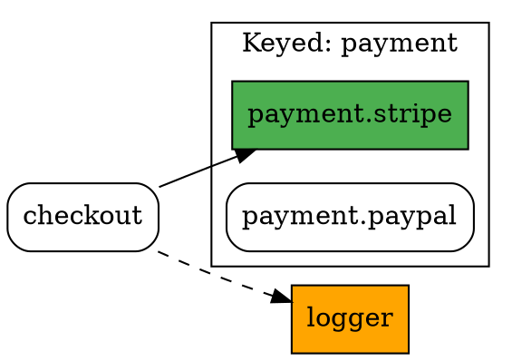

# Graph Exporter

Visualize your service dependency graph as Mermaid diagrams, Graphviz DOT, or plain JSON.

The `GraphExporter` gives you a full picture of your container's wiring — which services depend on which, which are lazy, which belong to keyed groups, and more. It is available via `container.exportGraph()` after registering your services (compilation is not required).

## Quick start

```js
import { ContainerBuilder } from 'node-dependency-injection'

const container = new ContainerBuilder()
// ... register services ...

// Mermaid diagram (default)
const mermaid = container.exportGraph()

// Graphviz DOT
const dot = container.exportGraph('dot')

// Raw JSON (nodes + edges + groups)
const json = container.exportGraph('json')
```

## Formats

### `mermaid` (default)

Produces a [Mermaid](https://mermaid.js.org/) `graph TD` diagram that you can paste directly into GitHub Markdown, Notion, or any Mermaid-compatible renderer.

```js
const mermaid = container.exportGraph('mermaid')
console.log(mermaid)
```

Example output:

```
graph TD
  subgraph payment [Keyed Group: payment]
    n1[StripePayment]
    n2[PaypalPayment]
  end
  n0[CheckoutService]
  n3[Logger]
  n0 --> n1
  n0 -.-> n3
  style n1 fill:#4CAF50,color:#fff
  style n3 fill:#FF9800,color:#fff
```

**Edge styles:**
- `-->` solid arrow — constructor dependency
- `-.->` dashed arrow — method-call or lazy dependency

**Node styles:**
- 🟢 green (`fill:#4CAF50`) — default keyed service (`.setDefault(true)`)
- 🟠 orange (`fill:#FF9800`) — lazy service
- dashed border (`stroke-dasharray: 5 5`) — prototype-scoped (non-shared) service

### `dot`

Produces a [Graphviz](https://graphviz.org/) DOT file. Render it with `dot -Tpng services.dot -o services.png` or paste into an online tool like [dreampuf.github.io/GraphvizOnline](https://dreampuf.github.io/GraphvizOnline/).

```js
const dot = container.exportGraph('dot')
```

Example output:



**Node styles:**
- `fillcolor="#4CAF50"` — default keyed service
- `fillcolor="orange"` — lazy service
- `style="dashed"` — prototype-scoped service

**Edge styles:**
- no style — constructor dependency
- `[style=dashed]` — lazy dependency
- `[style=dotted]` — method-call dependency

### `json`

Returns a plain JavaScript object with three arrays: `nodes`, `edges`, and `groups`. Useful for building custom visualizations or tooling.

```js
const { nodes, edges, groups } = container.exportGraph('json')
```

**Node shape:**

```js
{
  id: 'payment.stripe',         // service ID
  class: 'StripePayment',       // class name (or null)
  scope: 'singleton',           // 'singleton' | 'prototype'
  lazy: false,                  // true when lazy: true
  keyed: {                      // only present for keyed services
    group: 'payment',
    key: 'stripe',
    default: true
  }
}
```

**Edge shape:**

```js
{
  from: 'checkout',             // consumer service ID
  to: 'payment.stripe',        // dependency service ID
  type: 'constructor'           // 'constructor' | 'method' | 'lazy'
}
```

**Group shape:**

```js
{
  name: 'payment',              // keyed group name
  type: 'keyed',
  services: ['payment.paypal', 'payment.stripe'],
  default: 'payment.stripe'    // ID of the default service (or null)
}
```

## Filtering options

All formats accept an optional `options` object as the second argument to narrow down the graph output.

```js
container.exportGraph('json', options)
```

| Option | Type | Description |
|---|---|---|
| `excludePrivate` | `boolean` | Exclude services marked `public: false` |
| `filter` | `string \| RegExp \| Function` | Keep only services whose ID matches the filter |
| `tag` | `string` | Keep only services that have the given tag |
| `root` | `string` | Start from this service and follow dependencies |
| `depth` | `number` | Maximum traversal depth when `root` is set (default: unlimited) |

### `excludePrivate`

```js
container.exportGraph('json', { excludePrivate: true })
```

### `filter`

```js
// String — keep IDs that contain the substring
container.exportGraph('json', { filter: 'payment' })

// RegExp — keep IDs that match
container.exportGraph('json', { filter: /^payment\./ })

// Function — full control
container.exportGraph('json', { filter: (id) => id.startsWith('payment.') })
```

### `tag`

```js
container.exportGraph('json', { tag: 'event_listener' })
```

### `root` + `depth`

Traverse the dependency tree starting from a root service, optionally limited to a given depth:

```js
// Full subtree rooted at 'checkout'
container.exportGraph('json', { root: 'checkout' })

// Only the direct dependencies of 'checkout' (depth 1)
container.exportGraph('json', { root: 'checkout', depth: 1 })
```

## Full example

```js
import { ContainerBuilder, Reference, KeyedReference } from 'node-dependency-injection'
import CheckoutService from './CheckoutService'
import StripePayment from './payments/StripePayment'
import PaypalPayment from './payments/PaypalPayment'
import Logger from './Logger'

const container = new ContainerBuilder()

container.register('checkout', CheckoutService)
  .addArgument(new Reference('payment.stripe'))
  .addMethodCall('setLogger', [new Reference('logger')])

container.registerKeyed('payment', 'stripe', StripePayment).setDefault(true)
container.registerKeyed('payment', 'paypal', PaypalPayment).addTag('event_listener')
container.register('logger', Logger).lazy = true

// Export full Mermaid diagram
console.log(container.exportGraph('mermaid'))

// Export only the payment group services
console.log(container.exportGraph('dot', { filter: /^payment\./ }))

// Inspect the subtree of 'checkout' up to depth 2
const subtree = container.exportGraph('json', { root: 'checkout', depth: 2 })
console.log(subtree.nodes.map(n => n.id))
// → ['checkout', 'logger', 'payment.stripe']
```

## Related guides

- [Keyed Services](KeyedServices)
- [Lazy Service](LazyService)
- [Container Validation](ContainerValidation)
- [Tagging](Tagging)
